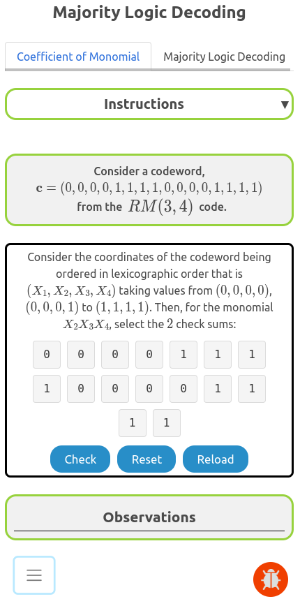

### Procedure

The experiment consists of two tasks. The user is recommended to go through these in the same sequence as they are presented.

1. Identify All Check-Sums Generated by a Monomial
    * Given a monomial, select all the checksums corresponding to it
2. Majority Logic Decoder
    * Given a received noisy codeword, simulate majority logic decoding to estimate the coefficients of all monomials in a RM(2,4) code.

## Overview of the Experiment window

    

The experiment window consists of the following components:
1. **Task tab**: The task tab contains the list of tasks that need to be performed in the experiment. The user can navigate to any task by clicking on the corresponding task in the task tab.
2. **Instruction box**: The instruction box displays step-by-step instructions to perform the task.
3. **Question box**: The question box displays the question to be answered by the user.
4. **Observation box**: The observation box displays the feedback messages based on the user's input.
5. **Action box**: The action box contains the input elements and buttons to perform the task.

## Experiment:

There are two tasks in this experiment.

### Task 1: Identify All Check-Sums Generated by a Monomial

Given a monomial, identify all the check-sum equations generated by it.

    

### Task 2: Majority Logic Decoder

Given a noisy received codeword, perform majority logic decoding to estimate the coefficients of all monomials.

    

